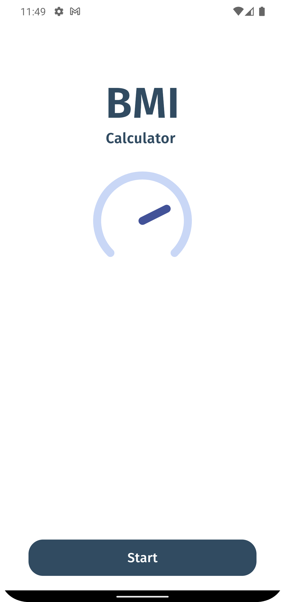
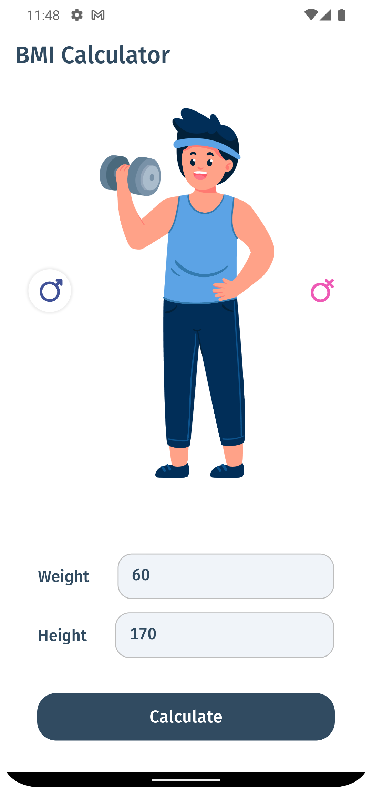
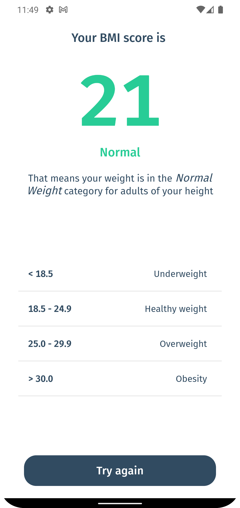

# BMI Calculator App

## Table of Contents

- [Overview](#overview)
- [Features](#-features)
- [How to Use](#-how-to-use)
- [Installation](#-installation)
- [Dependencies](#-dependencies)
- [Screenshots](#-screenshots)
- [Contributing](#-contributing)

## Overview

The BMI Calculator App is a simple, user-friendly application designed to calculate Body Mass Index (BMI). With a modern UI, it provides an intuitive and seamless user experience.

## 📌 Features

- **BMI Calculation**: Enter your height and weight, and the app will calculate your BMI.
- **BMI Classification**: Based on your BMI, the app will classify your weight status (e.g., underweight, normal weight, overweight, or obese).
- **Modern UI**: The app features a sleek, modern user interface that is easy to navigate.

## 📌 How to Use

1. **Enter your height and weight**: Use the input fields to enter your height (in meters) and weight (in kilograms).
2. **Calculate your BMI**: Click the 'Calculate' button, and the app will display your BMI.
3. **View your weight status**: Based on your BMI, the app will display your weight status.

## 📌 Installation

```bash
git clone https://github.com/dgirotto0/bmi_calculator.git
cd bmi_calculator
flutter run
```

## 📌 Dependencies

```yaml
dependencies:
  cupertino_icons: ^1.0.6
  flutter_svg: ^2.0.7
```
```yaml
dev_dependencies:
  flutter_lints: ^3.0.0
```

## 📌 Screenshots

```html
<div style="display:flex; justify-content:center;">
    
    
    
</div>
```

## 📌 Contributing

Contributions are welcome! If you'd like to contribute to this project, please fork the repository and submit a pull request.